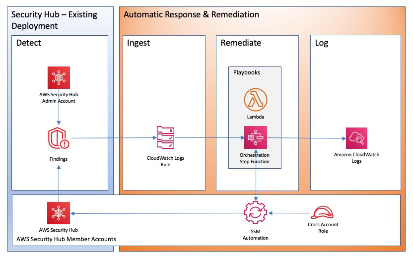

# AWS Security Hub Automated Response and Remediation

[🚀 Solution Landing
Page](https://aws.amazon.com/solutions/implementations/aws-security-hub-automated-response-and-remediation/)
\| [🚧 Feature
request](https://github.com/aws-solutions/aws-security-hub-automated-response-and-remediation/issues/new?assignees=&labels=feature-request%2C+enhancement&template=feature_request.md&title=)
\| [🐛 Bug
Report](https://github.com/aws-solutions/aws-security-hub-automated-response-and-remediation%3E/issues/new?assignees=&labels=bug%2C+triage&template=bug_report.md&title=)

Note: If you want to use the solution without building from source, navigate to
Solution Landing Page

## Table of contents

- [AWS Security Hub Automated Response and Remediation](#aws-security-hub-automated-response-and-remediation)
  - [Table of contents](#table-of-contents)
  - [Solution Overview](#solution-overview)
    - [Architecture Diagram](#architecture-diagram)
  - [AWS Solutions Constructs](#aws-solutions-constructs)
  - [Customizing the Solution](#customizing-the-solution)
    - [Prerequisites for Customization](#prerequisites-for-customization)
      - [Obtaining Source Code](#obtaining-source-code)
    - [Custom Playbooks](#custom-playbooks)
      - [Configure the Playbook](#configure-the-playbook)
      - [Create the Remediations](#create-the-remediations)
    - [Build and Deploy](#build-and-deploy)
      - [Build the solution](#build-the-solution)
      - [Run Unit Tests](#run-unit-tests)
    - [Upload to your buckets](#upload-to-your-buckets)
  - [Deploy](#deploy)
- [File structure](#file-structure)
- [Collection of operational metrics](#collection-of-operational-metrics)
- [License](#license)

<a name="solution-overview"></a>

## Solution Overview

AWS Security Hub Automated Response and Remediation is an add-on solution that
enables AWS Security Hub customers to remediate security findings with a single
click using predefined response and remediation actions called “Playbooks”.
Alternately the playbooks can also be configured to remediate findings in AWS
Security Hub automatically. The remediation is performed using AWS Lambda and in
some cases using AWS Systems Manager, the playbooks execute steps to remediate
security issues, such as unused keys, open security groups, password policies,
VPC configurations and public S3 buckets. The solution contains the playbook
remediations for some of the security standards defined as part of CIS AWS
Foundations Benchmark v1.2.0 and for AWS Foundational Security Best Practices
v1.0.0.

<a name="architecture-diagram"></a>

### Architecture Diagram



<a name="aws-solutions-constructs"></a>

## AWS Solutions Constructs

- aws-events-rule-lambda - creates event rules that trigger the appropriate remediation, as well as any necessary permissions.

<a name="customizing-the-solution"></a>

## Customizing the Solution

**Note**: If your goal is just to deploy the solution, please use the template on the [AWS Security Hub Automated Response and Remediation Landing Page](https://aws.amazon.com/solutions/implementations/aws-security-hub-automated-response-and-remediation/). *There is no need to build the solution from source.*

Detailed instructions for creating a new automated remediation in an existing Playbook can be found in the Implementation Guide. Instructions for creating an entirely new Playbook are below.

**Note**: If you choose to continue, please be aware that reading and adjusting the source code will be necessary.

<a name="prerequisites-for-customization"></a>

### Prerequisites for Customization

- a Linux client with the following software
  - AWS CLI v2
  - Python 3.7+ with pip
  - AWS CDK 1.155.0+
  - Node.js with npm
- source code downloaded from GitHub
- two S3 buckets (minimum): 1 global and 1 for each region where you will deploy
  - An Amazon S3 Bucket for solution templates - accessed globally via https.
  - An Amazon S3 Bucket for source code - regional.

#### Obtaining Source Code

Building from GitHub source will allow you to modify the solution to suit your specific needs. The process consists of downloading the source from GitHub, creating buckets to be used for deployment, building the solution, and uploading the artifacts needed for deployment.

Clone or download the repository to a local directory on your linux client. Note: if you intend to modify the solution you may wish to create your own fork of the GitHub repo and work from that. This allows you to check in any changes you make to your private copy of the solution.

**Git Clone example:**

```bash
git clone https://github.com/aws-solutions/aws-security-hub-automated-response-and-remediation.git
```

**Download Zip example:**

```bash
wget https://github.com/aws-solutions/aws-security-hub-automated-response-and-remediation/archive/main.zip
```

### Custom Playbooks

Go to source/playbooks in the solution source downloaded above. In this folder is a Playbook skeleton, **NEWPLAYBOOK**. Copy this entire folder and its contents as a new folder under source/playbooks. The naming convention is the security standard abbreviation followed by the version number, as they appear in the StandardsControlArn in the AWS Standard Finding Format for the security control.

**Example**

For PCI-DSS, we used "PCI" for the standard abbreviation. The version is 321: **PCI321**

```yaml
"StandardsControlArn": "arn:aws:securityhub:us-east-1:111111111111:control/pci-dss/v/3.2.1/PCI.IAM.7"
```

For CIS AWS Foundations Benchmark, we use "CIS". The version is 120: **CIS120**

```yaml
"StandardsControlArn": "arn:aws:securityhub:us-east-1:111111111111:control/cis-aws-foundations-benchmark/v/1.2.0/2.4"
```

Unless noted, all of the following changes are within the folder you just created for your new playbook.

1. Rename the typescript file in **bin** to match the (lower case) name of your new playbook. Ex. **pci321.ts**
2. Update cdk.json with the new file name
3. Rename the test typescript in the **test** subfolder similarly. Ex. **pci321_stack.test.ts**
4. Update the description.txt, README.md, and support.txt, following the example within.
5. Rename ssmdocs/scripts/newplaybook_parse_input.py as desired. This script parses the finding data. You will likely not need to modify it, as it's fairly robust. See other Playbooks for examples of its use.

#### Configure the Playbook

Edit **bin/\<standard\>.ts**. The following 3 lines are critical to definition of the Playbook. These values enable SHARR to map from the StandardsControlArn in a finding to your remediations.

```typescript
const standardShortName = 'NPB'
const standardLongName = 'New Playbook'
const standardVersion = '1.1.1' // DO NOT INCLUDE 'V'
```

**standardShortName** can be as you wish. General recommendation is to make it short and meaningful. Ex. PCI, CIS, AFSBP. This is the name used in many labels throughout the solution.
**standardLongName** must match the StandardsControlArn, as *pci-dss* in the above example.
**standardVersion** must match the StandardsControlArn version, as *.../v/3.2.1/...* in the above example.

Having established these values, your runbooks in **/ssmdocs** will be named: <standardShortName>-<control>.yaml

As you write your SSM runbooks, you will add them to the stack in the following code, where control must match the field from the StandardsControlArn:

```typescript
const remediations: IControl[] = [
    { "control": "RDS.6" }
]
```

#### Create the Remediations

Remediations are executed using SSM Automation Runbooks. Each control has a specific runbook. SHARR Runbooks must follow the naming convention in the **/ssmdocs** folder:

<standardShortName>-<control>.yaml

Follow examples from other Playbooks. Your SHARR runbook must parse the finding data, extract the fields needed for remediation, and execute a remediation runbook, passing the role name.

Remediation runbooks are defined in the /source/remediation_runbooks and /source/solution_deploy/remediation_runbooks-stack.ts. The remediation examples provided with the solution are fairly robust and self-documenting. Each definition creates an IAM role and an SSM runbook that is called by the SHARR runbook.

### Build and Deploy

AWS Solutions use two buckets: a bucket for global access to templates, which is accessed via HTTPS, and regional buckets for access to assets within the region, such as Lambda code. You will need:

- One global bucket that is access via the http end point. AWS CloudFormation templates are stored here. It must end with "-reference. Ex. "mybucket-reference"
- One regional bucket for each region where you plan to deploy using the name of the global bucket as the root, and suffixed with the region name. Ex. "mybucket-us-east-1"
- Your buckets should be encrypted and disallow public access

**Note**: When creating your buckets, ensure they are not publicly accessible. Use random bucket names. Disable public access. Use KMS encryption. And verify bucket ownership before uploading.

#### Build the solution

From the *deployment* folder in your cloned repo, run build-s3-dist.sh, passing the root name of your bucket (ex. mybucket) and the version you are building (ex. v1.0.0). We recommend using a semver version based on the version downloaded from GitHub (ex. GitHub: v1.0.0, your build: v1.0.0.mybuild)

```bash
chmod +x build-s3-dist.sh
build-s3-dist.sh -b <bucketname> -v <version>
```

#### Run Unit Tests

Some Python unit tests execute AWS API calls. The calls that create, read, or modify resources are stubbed, but some
calls to APIs that do not require any permissions execute against the real AWS APIs (e.g. STS GetCallerIdentity). The
recommended way to run the unit tests is to configure your credentials for a no-access console role.

```bash
cd ./deployment
chmod +x ./run-unit-tests.sh
./run-unit-tests.sh
```

Confirm that all unit tests pass.

### Upload to your buckets

**Note**: Verify bucket ownership before uploading.

By default, the templates created by build-s3-dist.sh expect the software to be stored in **aws-security-hub-automated-response-and-remediation/v\<version\>**. If in doubt, view the template.

Use a tool such as the AWS S3 CLI "sync" command to upload your templates to the reference bucket and code to the regional bucket.

<a name="deploy"></a>

## Deploy

See the [AWS Security Hub Automated Response and Remediation Implementation Guide](http://docs.aws.amazon.com/solutions/latest/aws-security-hub-automated-response-and-remediation/welcome.html) for deployment instructions, using the link to the SolutionDeployStack.template from your bucket, rather than the one for AWS Solutions. Ex. https://mybucket-reference.s3.amazonaws.com/aws-security-hub-automated-response-and-remediation/v1.3.0.mybuild/aws-sharr-deploy.template

<a name="file-structure"></a>
# File structure

aws-security-hub-automated-response-and-remediation uses AWS CDK for generating the cloudformation templates.
<pre>
|-source/
  |-Lambdalayer                  [ Common functions loaded as an AWS Lambda Layer for Orchestrator lambdas ]
  |-Orchestrator                 [ AWS Step Function and supporting lambdas ]
  |-playbooks                    [ Playbooks CloudDevelopment Kit Code and lambda source code]
    |- AFSBP/                    [ AFSBP v1.0.0 playbook code ]
    |- CIS120/                   [ CIS v1.2.0 playbook code ]
    |- PCI321/                   [ PCI-DSS v3.2.1 playbook code ]
  |-remediation_runbooks         [ Shared remediation runbooks ]
  |-solution_deploy              [ Solution Cloud Development Kit node module ]
  |-test                         [ CDK unit tests ]
</pre>

<a name="collection-of-operational-metrics"></a>
# Collection of operational metrics

This solution collects anonymous operational metrics to help AWS improve the
quality of features of the solution. For more information, including how to disable
this capability, please see the
[Implementation Guide](https://docs.aws.amazon.com/solutions/latest/aws-security-hub-automated-response-and-remediation/collection-of-operational-metrics.html)

<a name="license"></a>
# License

See license
[here](https://github.com/aws-solutions/aws-security-hub-automated-response-and-remediation/blob/main/LICENSE.txt)
