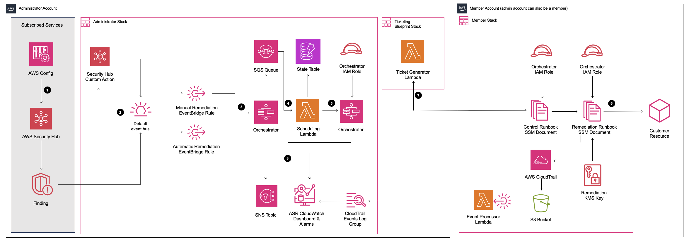

# Automated Security Response on AWS

[🚀 Solution Landing Page](https://aws.amazon.com/solutions/implementations/automated-security-response-on-aws/) \| [🚧
Feature
request](https://github.com/aws-solutions/automated-security-response-on-aws/issues/new?assignees=&labels=feature-request%2C+enhancement&template=feature_request.md&title=)
\| [🐛 Bug
Report](https://github.com/aws-solutions/automated-security-response-on-aws/issues/new?assignees=&labels=bug%2C+triage&template=bug_report.md&title=)

Automated Security Response (ASR) on AWS is a solution that enables AWS Security Hub customers to remediate findings
with a single click using sets of predefined response and remediation actions called Playbooks. The remediations are
implemented as AWS Systems Manager automation documents. The solution includes remediations for issues such as unused
access keys, open security groups, weak account password policies, VPC flow logging configurations, and public S3
buckets. Remediations can also be configured to trigger automatically when findings appear in AWS Security Hub.

The solution includes the playbook remediations for some of the security controls defined as part of the following
standards:

- AWS Foundational Security Best Practices (FSBP) v1.0.0
- Center for Internet Security (CIS) AWS Foundations Benchmark v1.2.0
- Center for Internet Security (CIS) AWS Foundations Benchmark v1.4.0
- Center for Internet Security (CIS) AWS Foundations Benchmark v3.0.0
- Payment Card Industry (PCI) Data Security Standard (DSS) v3.2.1
- National Institute of Standards and Technology (NIST) Special Publication 800-53 Revision 5

A Playbook called Security Control is included that allows operation with AWS Security Hub's Consolidated Control
Findings feature.

**Note**: To deploy the solution without building from the source code, use the CloudFormation templates linked from the
[Solution Landing Page](https://aws.amazon.com/solutions/implementations/automated-security-response-on-aws/).

## Architecture Diagram



## Customizing the Solution

Detailed instructions for creating a new automated remediation in an existing Playbook can be found in the
Implementation Guide. Instructions for creating an entirely new Playbook are below.

**Note**: If you choose to continue, please be aware that reading and adjusting the source code will be necessary.

### Prerequisites for Customization

- a Linux client with the following software
  - AWS CLI v2
  - Python 3.11+ with pip
  - AWS CDK 2.171.1+
  - Node.js 20+ with npm
- source code downloaded from GitHub


#### Obtaining Source Code

Building from GitHub source will allow you to modify the solution to suit your specific needs. The process consists of
downloading the source from GitHub, creating buckets to be used for deployment, building the solution, and uploading the
artifacts needed for deployment.

Clone or download the repository to a local directory on your linux client. Note: if you intend to modify the solution
you may wish to create your own fork of the GitHub repo and work from that. This allows you to check in any changes you
make to your private copy of the solution.

**Git Clone example:**

```bash
git clone https://github.com/aws-solutions/automated-security-response-on-aws.git
```

**Download Zip example:**

```bash
wget https://github.com/aws-solutions/automated-security-response-on-aws/archive/main.zip
```

### Custom Playbooks

Go to source/playbooks in the solution source downloaded above. In this folder is a Playbook skeleton, **NEWPLAYBOOK**.
Copy this entire folder and its contents as a new folder under source/playbooks. The naming convention is the security
standard abbreviation followed by the version number, as they appear in the StandardsControlArn in the AWS Standard
Finding Format for the security control.

**Example**

For PCI-DSS, we used "PCI" for the standard abbreviation. The version is 321: **PCI321**

```yaml
"StandardsControlArn": "arn:aws:securityhub:us-east-1:111111111111:control/pci-dss/v/3.2.1/PCI.IAM.7"
```

For CIS AWS Foundations Benchmark, we use "CIS". The version is 120: **CIS120**

```yaml
"StandardsControlArn": "arn:aws:securityhub:us-east-1:111111111111:control/cis-aws-foundations-benchmark/v/1.2.0/2.4"
```

Unless noted, all of the following changes are within the folder you just created for your new playbook.

1. Rename the typescript file in **bin** to match the (lower case) name of your new playbook. Ex. **pci321.ts**
2. Update cdk.json with the new file name
3. Rename the test typescript in the **test** subfolder similarly. Ex. **pci321_stack.test.ts**
4. Update the description.txt, README.md, and support.txt, following the example within.
5. Rename ssmdocs/scripts/newplaybook_parse_input.py as desired. This script parses the finding data. You will likely
   not need to modify it, as it's fairly robust. See other Playbooks for examples of its use.

#### Configure the Playbook

Edit **bin/\<standard\>.ts**. The following 3 lines are critical to definition of the Playbook. These values enable ASR
to map from the StandardsControlArn in a finding to your remediations.

```typescript
const standardShortName = "NPB";
const standardLongName = "New Playbook";
const standardVersion = "1.1.1"; // DO NOT INCLUDE 'V'
```

**standardShortName** can be as you wish. General recommendation is to make it short and meaningful. Ex. PCI, CIS,
FSBP. This is the name used in many labels throughout the solution. **standardLongName** must match the
StandardsControlArn, as _pci-dss_ in the above example. **standardVersion** must match the StandardsControlArn version,
as _.../v/3.2.1/..._ in the above example.

Having established these values, your runbooks in **/ssmdocs** will be named: <standardShortName>-<control>.yaml

As you write your SSM runbooks, you will add them to the stack in the following code, where control must match the field
from the StandardsControlArn:

```typescript
const remediations: IControl[] = [{ control: "RDS.6" }];
```

#### Add your playbook as a new nested stack in the solution template

Edit **playbooks/playbook-index.ts** to include the new playbook.

Add the new playbook to the end of the `standardPlaybookProps` array.

**Important** Do not change the order of the items in this array. Doing so will change the App Registry logical IDs for the nested stacks. 
This will cause an error when updating the solution.

Interface:

```typescript
export interface PlaybookProps {
  name: string; // Playbook short name
  useAppRegistry: boolean; // Add this playbook's nested stack to app registry for the solution
  defaultParameterValue?: 'yes' | 'no'; // Default value for enabling this playbook in CloudFormation. Will default to 'no' if not provided.
  description?: string; // Description for the CloudFormation parameter. Solution will provide a generated description if left blank.
}
```

#### Create the Remediations

Remediations are executed using SSM Automation Runbooks. Each control has a specific runbook. ASR Runbooks must follow
the naming convention in the **/ssmdocs** folder:

<standardShortName>-<control>.yaml

Follow examples from other Playbooks. Your ASR runbook must parse the finding data, extract the fields needed for
remediation, and execute a remediation runbook, passing the role name.

Remediation runbooks are defined in the /source/remediation_runbooks and
/source/solution_deploy/remediation_runbooks-stack.ts. The remediation examples provided with the solution are fairly
robust and self-documenting. Each definition creates an IAM role and an SSM runbook that is called by the ASR runbook.

### Build and Deploy

AWS Solutions use two buckets: a bucket for global access to templates, which is accessed via HTTPS, and regional
buckets for access to assets within the region, such as Lambda code. 

- Pick a unique bucket name, `e.g. asr-staging`. Set two environment variables on your terminal, one should be the base bucket name with `-reference` as suffix, the other with your intended deployment region as suffix:

```bash
export BASE_BUCKET_NAME=asr-staging-$(date +%s)
export TEMPLATE_BUCKET_NAME=$BASE_BUCKET_NAME-reference
export REGION=us-east-1
export ASSET_BUCKET_NAME=$BASE_BUCKET_NAME-$REGION
```

- In your AWS account, create two buckets with these names,
  e.g. `asr-staging-reference` and `asr-staging-us-east-1`. (The reference bucket will hold the CloudFormation templates, the regional bucket will hold all other assets like the lambda code bundle.)
- Your buckets should be encrypted and disallow public access

```bash
aws s3 mb s3://$TEMPLATE_BUCKET_NAME/
aws s3 mb s3://$ASSET_BUCKET_NAME/
```

**Note**: When creating your buckets, ensure they are not publicly accessible. Use random bucket names. Disable public
access. Use KMS encryption. And verify bucket ownership before uploading.

#### Build the solution

First ensure that you've run `npm install` in the _source_ folder.

Next from the _deployment_ folder in your cloned repo, run build-s3-dist.sh, passing the root name of your bucket (ex.
mybucket) and the version you are building (ex. v1.0.0). We recommend using a semver version based on the version
downloaded from GitHub (ex. GitHub: v1.0.0, your build: v1.0.0.mybuild)

```bash
chmod +x build-s3-dist.sh
export SOLUTION_NAME=automated-security-response-on-aws
export SOLUTION_VERSION=v1.0.0.mybuild
./build-s3-dist.sh -b $BASE_BUCKET_NAME -v $SOLUTION_VERSION
```

#### Run Unit Tests

Some Python unit tests execute AWS API calls. The calls that create, read, or modify resources are stubbed, but some
calls to APIs that do not require any permissions execute against the real AWS APIs (e.g. STS GetCallerIdentity). The
recommended way to run the unit tests is to configure your credentials for a no-access console role.

```bash
cd ./deployment
chmod +x ./run-unit-tests.sh
./run-unit-tests.sh
```

Confirm that all unit tests pass.

### Upload to your buckets

**Note**: Verify bucket ownership before uploading.

By default, the templates created by build-s3-dist.sh expect the software to be stored in
**automated-security-response-on-aws/\<version\>**. If in doubt, view the template.

Upload the build artifacts from `global-s3-assets/` to the template bucket and the artifacts from `regional-s3-assets/` to the regional bucket:

```bash
aws s3 ls s3://$TEMPLATE_BUCKET_NAME # test that bucket exists - should not give an error
aws s3 ls s3://$ASSET_BUCKET_NAME # test that bucket exists - should not give an error
cd ./deployment
aws s3 cp global-s3-assets/  s3://$TEMPLATE_BUCKET_NAME/$SOLUTION_NAME/$SOLUTION_VERSION/ --recursive --acl bucket-owner-full-control
aws s3 cp regional-s3-assets/  s3://$ASSET_BUCKET_NAME/$SOLUTION_NAME/$SOLUTION_VERSION/ --recursive --acl bucket-owner-full-control
```

_✅ All assets are now staged on your S3 buckets. You or any user may use S3 links for deployments_

## Deploy

Consult the [Automated Security Response on AWS Implementation
Guide](https://docs.aws.amazon.com/solutions/latest/automated-security-response-on-aws/solution-overview.html) for detailed 
deployment instructions and set all deployment parameters according to your needs. 
When following the instructions, keep in mind to use the URLs to the templates in your own bucket.

If you anticipate that you will need to deploy multiple times during your development iterations, you can alternatively compose an `aws cloudformation create-stack` command with your desired parameter values, and deploy from the terminal.
For example:

```bash
  export ADMIN_TEMPLATE_URL=https://$TEMPLATE_BUCKET_NAME.s3.amazonaws.com/$SOLUTION_NAME/$SOLUTION_VERSION/aws-sharr-deploy.template
  aws cloudformation create-stack \
  --capabilities CAPABILITY_NAMED_IAM \
  --stack-name ASR-Admin-$(date +%s) \
  --template-url $ADMIN_TEMPLATE_URL \
  --parameters \
    ParameterKey=LoadSCAdminStack,ParameterValue=yes \
    ParameterKey=LoadAFSBPAdminStack,ParameterValue=no \
    ParameterKey=LoadCIS120AdminStack,ParameterValue=no \
    ParameterKey=LoadCIS140AdminStack,ParameterValue=no \
    ParameterKey=LoadCIS300AdminStack,ParameterValue=no \
    ParameterKey=LoadNIST80053AdminStack,ParameterValue=no \
    ParameterKey=LoadPCI321AdminStack,ParameterValue=no \
    ParameterKey=ReuseOrchestratorLogGroup,ParameterValue=no \
    ParameterKey=UseCloudWatchMetrics,ParameterValue=yes \
    ParameterKey=UseCloudWatchMetricsAlarms,ParameterValue=yes \
    ParameterKey=RemediationFailureAlarmThreshold,ParameterValue=5 \
    ParameterKey=EnableEnhancedCloudWatchMetrics,ParameterValue=no \
    ParameterKey=TicketGenFunctionName,ParameterValue= 
    
  export NAMESPACE=$(date +%s | tail -c 9)
  export MEMBER_TEMPLATE_URL=https://$TEMPLATE_BUCKET_NAME.s3.amazonaws.com/$SOLUTION_NAME/$SOLUTION_VERSION/aws-sharr-member.template
  aws cloudformation create-stack \
  --capabilities CAPABILITY_NAMED_IAM \
  --stack-name ASR-Member-$(date +%s) \
  --template-url $MEMBER_TEMPLATE_URL \
  --parameters \
    ParameterKey=LoadSCMemberStack,ParameterValue=yes \
    ParameterKey=LoadAFSBPMemberStack,ParameterValue=no \
    ParameterKey=LoadCIS120MemberStack,ParameterValue=no \
    ParameterKey=LoadCIS140MemberStack,ParameterValue=no \
    ParameterKey=LoadNIST80053MemberStack,ParameterValue=no \
    ParameterKey=LoadPCI321MemberStack,ParameterValue=no \
    ParameterKey=CreateS3BucketForRedshiftAuditLogging,ParameterValue=no \
    ParameterKey=LogGroupName,ParameterValue=random-log-group-123456789012 \
    ParameterKey=Namespace,ParameterValue=$NAMESPACE \
    ParameterKey=SecHubAdminAccount,ParameterValue=123456789012
    
  export MEMBER_ROLES_TEMPLATE_URL=https://$TEMPLATE_BUCKET_NAME.s3.amazonaws.com/$SOLUTION_NAME/$SOLUTION_VERSION/aws-sharr-member-roles.template
  aws cloudformation create-stack \
  --capabilities CAPABILITY_NAMED_IAM \
  --stack-name ASR-Member-Roles-$(date +%s) \
  --template-url $MEMBER_ROLES_TEMPLATE_URL \
  --parameters \
    ParameterKey=Namespace,ParameterValue=$NAMESPACE \
    ParameterKey=SecHubAdminAccount,ParameterValue=123456789012
```

## Directory structure

<pre>
|-.github/                [ GitHub pull request template, issue templates, and workflows ]
|-deployment/             [ Scripts used to build, test, and upload templates for the solution ]
|-simtest/                [ Tool and sample data used to simulate findings for testing ]
|-source/                 [ Solution source code and tests ]
  |-layer/                [ Common functions used by the Orchestrator and custom resource providers ]
  |-lib/                  [ Solution CDK ]
    |-appregistry/        [ Resources for integration with Service Catalog AppRegistry ]
    |-cdk-helper/         [ CDK helper functions ]
    |-member/             [ Member stack helper functions ]
    |-tags/               [ Resource tagging helper functions ]
  |-Orchestrator/         [ Orchestrator Step Function Lambda Functions ]
  |-playbooks/            [ Playbooks ]
    |-AFSBP/              [ AWS FSBP v1.0.0 playbook ]
    |-CIS120/             [ CIS v1.2.0 playbook ]
    |-CIS140/             [ CIS v1.4.0 playbook ]
    |-common/             [ Common scripts used by multiple playbooks ]
    |-NEWPLAYBOOK/        [ Example playbook ]
      |-bin/              [ Playbook CDK App ]
      |-ssmdocs/          [ Control runbooks ]
    |-PCI321/             [ PCI-DSS v3.2.1 playbook ]
    |-SC/                 [ Security Control playbook ]
  |-remediation_runbooks/ [ Shared remediation runbooks ]
    |-scripts/            [ Scripts used by remediation runbooks ]
  |-solution_deploy/      [ Solution CDK App and custom resource providers ]
    |-bin/                [ Solution CDK App ]
    |-source/             [ Custom resource providers ]
  |-test/                 [ CDK and SSM document unit tests ]
</pre>

## Collection of operational metrics

This solution collects anonymized operational metrics to help AWS improve the quality of features of the solution. For
more information, including how to disable this capability, please see the [Implementation
Guide](https://docs.aws.amazon.com/solutions/latest/automated-security-response-on-aws/collection-of-operational-metrics.html)

## License

Distributed under the Apache License Version 2.0. For more information, see [LICENSE.txt](LICENSE.txt).
