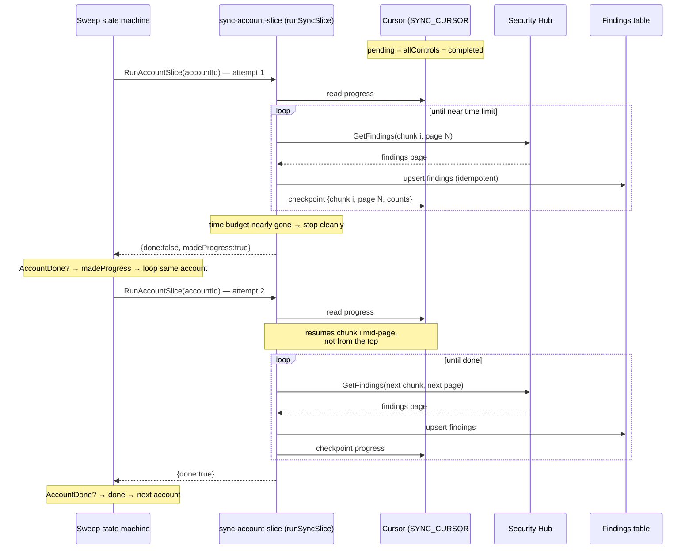

# Finding Synchronization Scaling

**Status:** Implemented and shipped. AppSec-approved (including the circuit breaker in §5).

Finding synchronization scales to large fleets by combining three mechanisms into one self-driving
feature:

1. **A resumable cursor** — each run persists how far it got, so a run that hits the 15-minute Lambda
   limit resumes instead of restarting.
2. **Per-account slicing** — the sweep enumerates the org's Security Hub member accounts (via
   `securityhub:ListMembers`) and syncs each account as its own resumable unit, keyed
   `SYNC_CURSOR#<accountId>`, with a `SYNC_SWEEP#global` record tracking fleet-wide progress.
3. **A Step Functions sweep** — a state machine drives the whole fleet: it enumerates accounts, syncs
   them **sequentially** (`MaxConcurrency: 1`, to stay under the Security Hub `GetFindings` rate limit),
   and re-invokes the sync Lambda for the same account until that account's cursor reports `done`,
   bounded by a per-account **circuit breaker** (§5).

The sweep runs automatically — once at deploy time (via a CloudFormation custom resource) and weekly
(Saturdays, 02:00 UTC, via EventBridge). It **runs to completion on its own**; no operator has to
re-invoke anything, and starting the sweep a second time on the same day is a harmless no-op.

---

## 1. Context: what finding synchronization is for

ASR keeps a **Findings table** in DynamoDB that backs the ASR Web UI. Each row is one Security Hub
finding plus ASR-specific state (remediation status, suppression, etc.). Two things write to it:

1. **Real-time path (PreProcessor).** As Security Hub emits finding events, they flow through
   EventBridge → SQS → the PreProcessor Lambda, which keeps the table current one finding at a time.
   This path works and is not what this document is about.

2. **Synchronization path (this document).** `SO0111-ASR-SynchronizationFindingsLambda` is a periodic
   **backfill / reconciliation** job. It exists to catch what the event stream misses: findings that
   predate the ASR install, events dropped during an outage, or any drift between Security Hub and the
   table. It runs once at deploy time and then weekly (Saturdays, 02:00 UTC).

If synchronization can't finish, the table is missing findings — and the Web UI shows an incomplete
picture.

---

## 2. The customer problem

A large customer reported **73,000+ findings across 308 accounts**. On that volume the original sync
Lambda:

- **Always timed out at 15 minutes** (the Lambda maximum) and never finished a full sync.
- **Reprocessed the same ~11,000 findings every run** and never reached the rest.
- **Left whole accounts missing from the Web UI.**

The cause in one sentence: the Lambda tried to sync the **entire fleet in a single run**, always started
over from the beginning, and always walked findings in the **same order** (highest-severity first) — so
it burned its whole 15 minutes on the same top slice and never reached the long tail. Accounts whose
findings sat past that cutoff were never imported.

The fix removes the single-invocation ceiling: the work is split per account, each account resumes from
a saved cursor, and a state machine keeps re-running each account until it is fully imported.

---

## 3. The design

### 3.1 The cursor — remember where the sync left off

**Before:** every run started from finding #1. A run that timed out threw away all its progress, so the
next run re-did the same work and never got further.

**Now:** before the Lambda hits its time limit, it **saves a bookmark** — a *cursor* — recording how far
it got, then exits cleanly. The next slice reads the cursor and **picks up where the last one stopped**
instead of starting over. The cursor lives in the **existing Findings table** (no new table), as an
isolated item type that carries none of the discriminator attributes the reader GSIs key on, so it is
invisible to every reader path.

Position is tracked as a **set of completed controlIds**, not a scalar index, because the supported
control set can change between runs (a customer enables/disables a control). Resume is then
`pending = allControlIds − completedControlIds`: a newly-added control simply becomes pending, a removed
one is harmlessly ignored, and no stable ordering or chunking is required. Within an account, controls
with automated remediation enabled are synced first, so remediation can act on the highest-value
findings soonest.

This is what actually lets all 73k findings get imported: each slice advances the import a bit further,
and a slice timing out is no longer a failure, just a pause.

### 3.2 Per-account slicing + account enumeration

**Now:** the sync works **by account** instead of by a single global control walk. The sweep enumerates
the org's member accounts and syncs one account per invocation as its own resumable unit (keyed
`SYNC_CURSOR#<accountId>`), with a `SYNC_SWEEP#global` record tracking fleet-wide progress.

To loop over accounts — and to report a truthful "308 total" — the system needs the **list of all
accounts**. That list can't be derived from the findings table (empty on first deploy) or the
user-account-mapping table (can be empty). The authoritative source is `securityhub:ListMembers`,
available in the aggregation account where the solution runs.

Progress reads in plain terms — **"18 / 308 accounts synced"**. The sync already emitted an anonymous
usage-metrics payload on every run (`sendMetrics`); this feature **adds per-account attributes** to that
existing payload (`account_id`, `completed_accounts`, `total_accounts`, `sync_done`,
`processed_control_ids` / `total_control_ids`, `processed_findings`) and to the structured logs — it does
not introduce a new metrics channel. `completedAccounts` is **derived** from the count of done cursors on
read (`countCompletedAccounts()`), not a maintained counter, so it stays correct even when several
account slices complete around the same time.

### 3.3 The Step Functions sweep — self-driving and safe

**Now:** a **Step Functions state machine** owns all orchestration. Its shape is:

> **Enumerate accounts** → **Map (concurrency 1) over accounts** → **Mark sweep done**

- **Sequential by design.** The Map runs `MaxConcurrency: 1`: the slice Lambda's paging is tuned against
  the Security Hub `GetFindings` rate limit, so two concurrent account slices would throttle.
- **Per-account resume loop.** Each Map branch runs one ≤14:30 slice for an account. Because a single
  large account may not drain in one 15-minute invocation, an `AccountDone?` `Choice` re-invokes the
  **same account's** slice (resuming from its cursor) until the slice reports `done` — bounded by the
  circuit breaker in §5.
- **Fault-tolerant.** A `Catch` on `States.ALL` routes a failing account into a success state, so one
  bad account never fails the whole sweep (the inline-Map stand-in for `ToleratedFailurePercentage:
  100`). The account's cursor still records it did not finish, so the next run retries it.

The state machine owns all orchestration — both the fan-out across accounts and the resume loop within
one account. The sync Lambda holds no `lambda:InvokeFunction` grant and never invokes itself; it serves
**only** the three state-machine tasks: `enumerate-accounts`, `sync-account-slice`, and
`mark-sweep-done`. Every invocation is one of those tasks.

**How the sweep is started:**

- **At deploy time** — a CloudFormation custom resource calls `states:StartExecution` on the sweep state
  machine. The execution name is deterministic per UTC day (`initial-sync-YYYY-MM-DD`), so a stack-create
  retry can't launch a second concurrent sweep; `ExecutionAlreadyExists` means "already running today,"
  the desired state.
- **Weekly** — an EventBridge rule (Saturdays, 02:00 UTC) targets the same state machine.

Because the state machine self-drives to completion, **no manual re-triggering is expected** during
normal deploy or weekly operation. (An administrator with `states:StartExecution` on the sweep state
machine *can* start it on demand, but that is not part of standard operation and is not documented as
customer guidance.)

---

## 4. Diagram — how the sweep converges to a complete import

The cursor is the one part where a picture helps: it shows how the state machine's per-account resume
loop turns several time-limited slices into a complete import, and how a slice that stops partway through
a chunk resumes correctly instead of restarting.

---

## 5. Circuit breaker + worst-case cost (AppSec)

> **Status:** implemented. AppSec approved the state-machine architecture with two asks — a circuit
> breaker limiting the per-account resume loop to a configurable **5**, and a worst-case cost calc. Both
> are addressed below and reflect the built code (`synchronization-findings-construct.ts`).

### 5.1 What the state machine does

The resume mechanism is a **state-machine loop**:

- The Map invokes the Lambda once per account with `{ task: 'sync-account-slice', accountId }`. That task
  runs **one ≤14:30 slice**, checkpoints its own cursor, and returns `{ done, madeProgress, ... }` under
  `$.slice`. The Lambda reports status only; the state machine decides whether to loop.
- A `DecrementAttempts` `Pass` decrements the per-account attempt counter, then the `AccountDone?`
  `Choice` decides:
  - `$.slice.done == true` → `AccountSliceComplete` (branch done — checked first, so a slice that finishes
    on its last attempt still counts as complete);
  - `$.attemptsRemaining <= 0` → `AccountSliceExhausted` (**circuit breaker tripped**);
  - `$.slice.madeProgress == true` → back to **`RunAccountSlice`** — the state machine re-invokes the
    Lambda for the **same account**, which resumes from its cursor;
  - otherwise → `AccountSliceTolerated` (no-progress stall, stop without looping).
- A `Catch` on `States.ALL` also routes into `AccountSliceTolerated`, so one bad account never fails the
  sweep (the inline-Map stand-in for `ToleratedFailurePercentage: 100`).

### 5.2 Circuit breaker — enforced by the state machine, not the Lambda

AppSec's ask was "limit the resume loop to 5." Because the loop is a state-machine `Choice`, the breaker
is implemented **in the state machine itself**, so it holds even if the Lambda's cursor/DynamoDB logic is
buggy — which is the whole point of a breaker (it must not share a failure mode with the thing it guards):

- **`attemptsRemaining` lives in the execution state.** Each Map item is seeded with
  `attemptsRemaining = $.maxAttempts` (from the `SyncMaxAttemptsPerAccount` stack parameter).
- **`DecrementAttempts` is a `Pass` using `States.MathAdd($.attemptsRemaining, -1)`** — a pure Step
  Functions intrinsic, **zero Lambda involvement**. Even if the Lambda buggily reported
  `done: false, madeProgress: true` forever, the branch stops after `maxAttempts` invocations.
- **`RunAccountSlice` uses `resultPath: '$.slice'`** so the Lambda's return can never clobber the
  top-level counter.
- **`SyncMaxAttemptsPerAccount` — a CloudFormation stack parameter, default 5** (range 1–100). This is
  the customer-tunable knob AppSec asked for. It is a stack parameter rather than a Lambda env var because
  the counter lives in the state machine, not the Lambda; raise it for a customer with an exceptionally
  large single account.

**Why this is not the "hard cap abandons large accounts" trap.** 5 attempts × one ~14-minute slice each,
and each slice imports up to ~10k findings, so the breaker gives **>50k findings of headroom per
account** before it trips. The reference customer has **~77k findings across ~300 accounts** — well under
1k per account on average — so no real account comes near the cap. The breaker only fires for a genuinely
stuck/looping account, which is exactly the bug case it exists to contain; a tripped account is left
`not-done` and simply resumes on the next weekly sweep. If a customer ever has a single account larger
than ~50k findings, they raise `SyncMaxAttemptsPerAccount`.

- **Free backstops (defense in depth):** AWS Lambda native recursive-loop detection (~16 hops, on by
  default) and the state machine's own 24 h `timeout`. Neither is tunable to 5, so the `Choice` counter
  is the primary control.

### 5.3 Worst-case cost

All figures us-east-1, on-demand, and **worst case** (assume every slice runs the full 15 minutes).

**Per stuck account that trips the breaker (5 × 15-min slices @ 512 MB):**
- Compute: 5 × 900 s × 0.5 GB = **2,250 GB-s** × \$0.0000166667 ≈ **\$0.0375**
- Requests: 5 × \$0.20/M ≈ \$0.000001
- **≈ \$0.038 per stuck account.**

**Pathological fleet ceiling — if *all* ~300 accounts hit the 5-slice cap** (cannot happen for the
reference customer, whose accounts are ~hundreds of findings each, but it bounds the blast radius):
- Lambda: 300 × \$0.0375 ≈ **\$11.25 per sweep.**
- Step Functions (Standard): ~16 state transitions/account × 300 + 4 ≈ 4,804 × \$0.000025 ≈ **\$0.12.**

**DynamoDB writes for a realistic full import of 77k findings:**
- Per-finding upserts: **77,000** (one `updateWithIncomingData` per finding).
- Cursor page checkpoints: ~1 per `GetFindings` page (~100 findings/page) ≈ **~770**.
- Per-account `done` cursor writes + sweep reset/done: **~302**.
- **Total ≈ 78,100 writes** × \$1.25/M (on-demand, ~1 KB items) ≈ **\$0.10.**

**Bottom line:** the dominant cost is Lambda compute, and even the impossible "every account stuck at the
cap" ceiling is **~\$11–12 per sweep**. A normal weekly sweep of an already-imported fleet (mostly
`putIfNewer` no-ops, few full slices) is a few cents. The circuit breaker's cost contribution is strictly
bounded by `SyncMaxAttemptsPerAccount` × accounts × 15-min slices, which is the number above.
